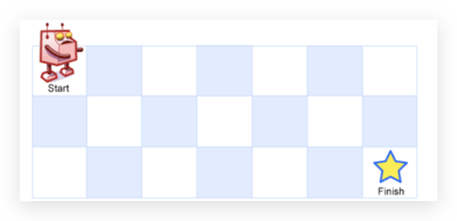

# 不同路径

> 一个机器人位于一个`m, x n`网络的左上角（起始点在下图中标记为`"Start"`）。
> 机器人每次只能`向下`或者`向右`移动一步。机器人视图打到网格的右下角（在下图标记为`Finish`）
> 问总共有多少条不同的路径？


## 示例：
---
```
输入：m = 3, n = 7
输出：28
```
---
```
输入：m = 3, n = 2
输出：3
解释：
从左上角开始，总共有 3 条路径可以到达右下角。
1. 向右 -> 向下 -> 向下
2. 向下 -> 向下 -> 向右
3. 向下 -> 向右 -> 向下
```
---
```
输入：m = 7, n = 3
输出：28
```
---
```
输入：m = 3, n = 3
输出：6
```
---

提示：
  - 1 <= intervals.length <= 104
  - intervals[i].length == 2
  - 0 <= start <= end <= 104


m = 7
n = 3


