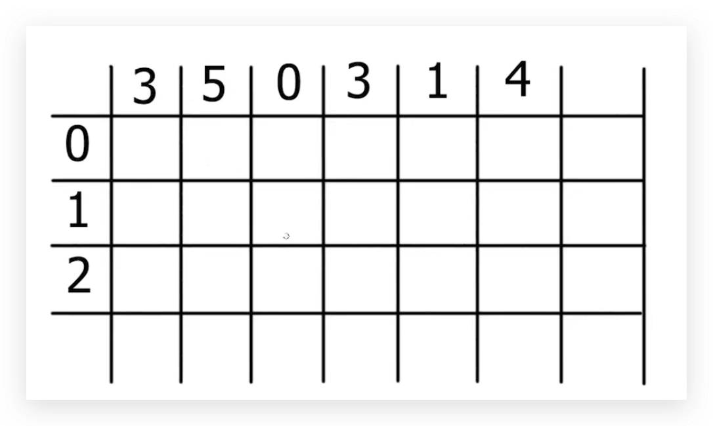

# 买卖股票的最佳时机
- 给定一个数组，它的第`i`个元素表示一支给定股票的第`i`天的价格。
- 设计一个算法来计算你所能获取的最大利润。你最多可以完成两笔交易。
- `注意：你不能同时参与多笔交易（你必须在再次购买前出售掉之前的股票）。`


## 示例1：
```
输入：prices = [3,3,5,0,0,3,1,4]
输出：6
解释：在第 4 天（股票价格 = 0）的时候买入，在第 6 天（股票价格 = 3）的时候卖出，这笔交易所能获得利润 = 3-0 = 3 。
    随后，在第 7 天（股票价格 = 1）的时候买入，在第 8 天 （股票价格 = 4）的时候卖出，这笔交易所能获得利润 = 4-1 = 3 。
```
---
## 示例2：
```
输入：prices = [1,2,3,4,5]
输出：4
解释：在第 1 天（股票价格 = 1）的时候买入，在第 5 天 （股票价格 = 5）的时候卖出, 这笔交易所能获得利润 = 5-1 = 4 
  注意你不能在第 1 天和第 2 天接连购买股票，之后再将它们卖出。   
  因为这样属于同时参与了多笔交易，你必须在再次购买前出售掉之前的股票。

```
---
## 示例3：
```
输入：prices = [7,6,4,3,1] 
输出：0
解释：在这种情况下，没有交易完成，所以最大利润为0
```
---
## 示例4：
```
输入：prices = [1]
输出：0
```
---

提示：
- 1 <= prices.length <= 10**5
- 0 <= prices[i] <= 10**4

## 示例


